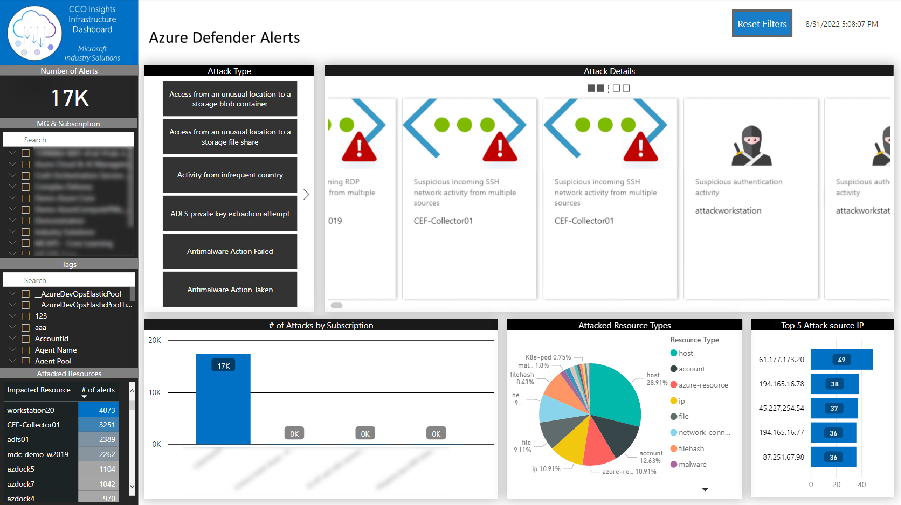
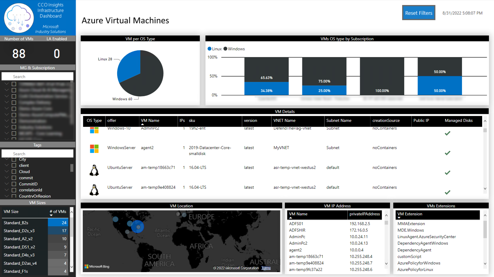
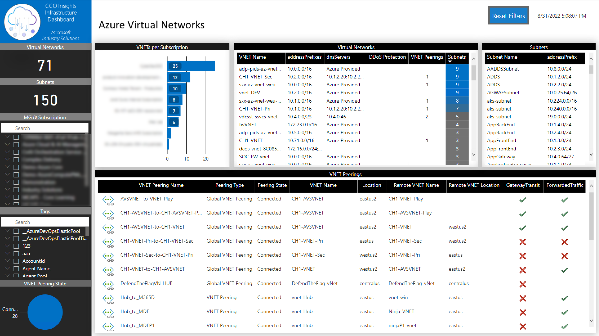
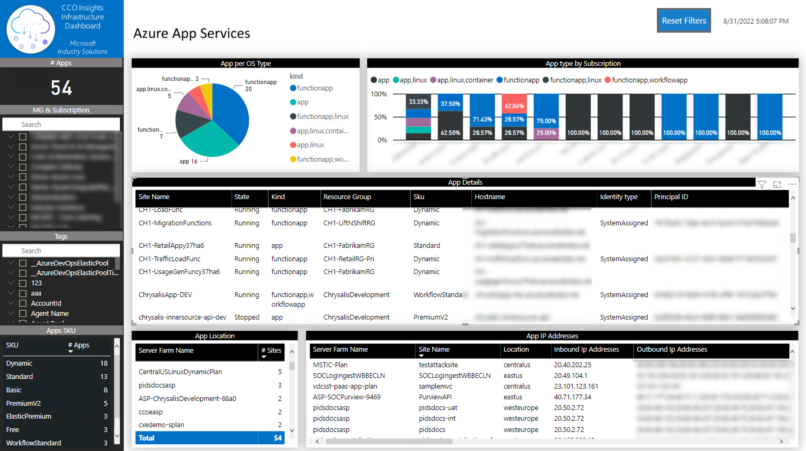
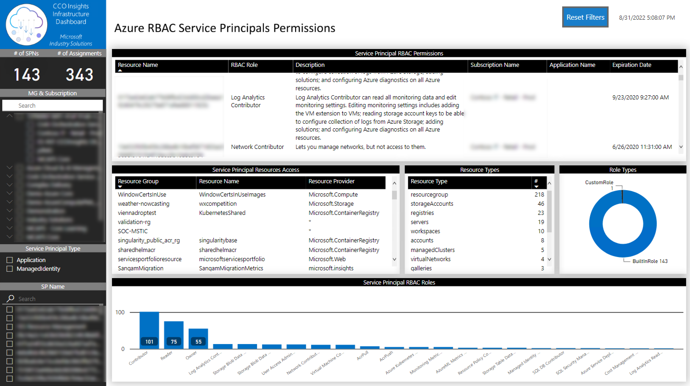
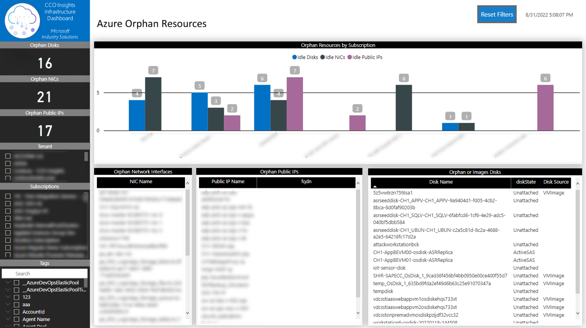

# CCO Azure Infrastructure Dashboard

- [CCO Azure Infrastructure Dashboard](#cco-azure-infrastructure-dashboard)
  - [Overview](#overview)
    - [Requirements](#requirements)
  - [APIs in use](#apis-in-use)
  - [Resource Providers requirements](#resource-providers-requirements)
  - [Azure Advisor Recommendations](#azure-advisor-recommendations)
    - [Generating Azure Advisor recommendations manually](#generating-azure-advisor-recommendations-manually)
  - [Azure Security Center Recommendations](#azure-security-center-recommendations)
- [Setting up the Continuous Cloud Optimization Azure Infrastructure Power BI Dashboard](#setting-up-the-continuous-cloud-optimization-azure-infrastructure-power-bi-dashboard)
  - [Template download](#template-download)
  - [Environment selection](#environment-selection)
  - [Modify Privacy settings](#modify-privacy-settings)
  - [Credentials](#credentials)
    - [Clean Credentials on the Data Source](#clean-credentials-on-the-data-source)
    - [Refresh the dashboard](#refresh-the-dashboard)
    - [Credentials for management.azure.com REST API request:](#credentials-for-managementazurecom-rest-api-request)
    - [Credentials for graph.windows.net API](#credentials-for-graphwindowsnet-api)
    - [Credentials for api.loganalytics.io API](#credentials-for-apiloganalyticsio-api)
    - [Enter Access Web content credentials](#enter-access-web-content-credentials)
- [Report Pages](#report-pages)
  - [CCO Azure Infrastructure Dashboard overview page](#cco-azure-infrastructure-dashboard-overview-page)
  - [Azure Advisor Recommendations page](#azure-advisor-recommendations-page)
  - [Azure Defender Alerts page](#azure-defender-alerts-page)
  - [Azure Compute Overview page](#azure-compute-overview-page)
  - [Azure VNETs and Subnets Recommendations page](#azure-vnets-and-subnets-recommendations-page)
  - [Azure Network Security Groups page](#azure-network-security-groups-page)
  - [Azure App Services page](#azure-app-services-page)
  - [Role Based Access Control page](#role-based-access-control-page)
  - [Service Principal Role Based Access Control page](#service-principal-role-based-access-control-page)
  - [IaaS Usage and Limits page](#iaas-usage-and-limits-page)
  - [IaaS Idle Resources Dashboard page](#iaas-idle-resources-dashboard-page)
  - [Azure Kubernetes Service Dashboard Overview page](#azure-kubernetes-service-dashboard-overview-page)
  - [Azure Kubernetes Service page](#azure-kubernetes-service-page)
- [Scripts](#scripts)
  - [Generate All Subscriptions Advisor Recommendations](#generate-all-subscriptions-advisor-recommendations)
  - [PowerBI Dashboard Read Permissions Role](#powerbi-dashboard-read-permissions-role)
  - [Check last Azure API version](#check-last-azure-api-version)
  - [PowerBI Dashboard Read Permissions Role (JSON)](#powerbi-dashboard-read-permissions-role-json)

## Overview

The Continuous Cloud Optimization Azure Infrastructure Power BI Dashboard is a report that aims to aggregate and consolidate the information generated by several Azure services to gain quick insights on your subscriptions to enable data driven business and technical optimization decisions. The main data sources for this Azure Infrastructure Dashboard are the **Azure Advisor REST API**, **Azure Security Center REST API**, **Azure Graph REST API**, **Log Analytics API** and several **Azure IaaS REST APIs**.

### Requirements

- The CCO Azure Infrastructure Dashboard is a Power BI Template that requires to download and install the Microsoft Power BI Desktop Edition from the Microsoft Store. Below you can find the minimum requirements to run the Dashboard
    -	Windows 10 version **14393.0** or **higher**.
    -	Internet access from the computer running Microsoft Power BI desktop.
    - An Azure account on the desired tenant space with permissions on the subscriptions to read from the Azure Services described above.
    - The subscriptions will need to use the Azure Security Center **Standard** plan if you want to detect and see the alerts in the Azure Security Center Alerts page of the CCO Azure Infrastructure Dashboard.

Below you can find the list of providers and the actions that you will need to permit to allow to run the CCO Power BI Dashboard:
</div>

| Resource Provider Name| Permissions |
| --- | --- |
|Azure Advisor| Microsoft.Advisor/generateRecommendations/action <br>
|*|*/Read|

## APIs in use

The CCO Azure Infrastructure Dashboard pulls the information from several APIs. You can read the public documentation if you need further information about the calls and methods available:
<br><br>
</div>

| API Name| Dashboard API Version | Last API version | Using latest version|
| --- | :---: | :---: |:---: |
| [Azure Advisor](https://docs.microsoft.com/en-us/rest/api/advisor/) | 2020-01-01|2020-01-01|:heavy_check_mark:|
| [Azure Security Center Alerts](https://msdn.microsoft.com/en/US/library/mt704034(Azure.100).aspx)  |2019-01-01 |2019-01-01|:heavy_check_mark:|
| [Azure Kubernetes Service](https://docs.microsoft.com/en-us/rest/api/aks) | 2019-08-01|2019-08-01|:heavy_check_mark:|
| [Azure Compute](https://docs.microsoft.com/en-us/rest/api/compute) | 2019-03-01|2019-03-01|:heavy_check_mark:|
| [Azure Disks](https://docs.microsoft.com/en-us/rest/api/compute/disks/list) | 2019-03-01|2019-03-01|:heavy_check_mark:|
| [Azure Virtual Networks](https://docs.microsoft.com/en-us/rest/api/virtual-network) | 2019-04-01|2019-04-01|:heavy_check_mark:|
| [Azure Network Interfaces](https://docs.microsoft.com/en-us/rest/api/virtualnetwork/networkinterfaces) |2019-04-01 |2019-04-01|:heavy_check_mark:|
| [Resource Groups](https://docs.microsoft.com/en-us/rest/api/resources/resourcegroups)  |2019-05-01 |2019-05-01|:heavy_check_mark:|
| [Azure Resources](https://docs.microsoft.com/en-us/rest/api/resources/resources)  |2019-10-01 |2019-10-01|:heavy_check_mark:|
| [Azure Subscriptions](https://docs.microsoft.com/en-us/rest/api/resources/subscriptions)  |2020-01-01 |2020-01-01|:heavy_check_mark:|
| [Azure Locations](https://docs.microsoft.com/en-us/rest/api/resources/subscriptions/listlocations)  |2019-05-01 |2019-05-01|:heavy_check_mark:|
| [Azure Role Assignments](https://docs.microsoft.com/en-us/rest/api/authorization/roleassignments) |2015-07-01 |2015-07-01|:heavy_check_mark:|
| [Azure Role Definitions](https://docs.microsoft.com/en-us/rest/api/authorization/roledefinitions) |2015-07-01 |2015-07-01|:heavy_check_mark:|
| [Azure Container Registry](https://docs.microsoft.com/en-us/rest/api/containerregistry/)  | 2017-10-01|2017-10-01|:heavy_check_mark:|
| <span style="color:#0088cc">Log Analytics Rest API </span> ([1](https://docs.microsoft.com/en-us/rest/api/loganalytics/), [2](https://dev.loganalytics.io/))  |v1 |v1|:heavy_check_mark:|
| [Azure Active Directory Graph API](https://docs.microsoft.com/en-us/azure/active-directory/develop/active-directory-graph-api) | 1.6|1.6 |:heavy_check_mark:|

API URLs by environment:

| API Name| API URL | Environment|
| --- | :---: | :---: |
| Management |https://management.azure.com/|Global|
| Azure AD Graph |https://graph.windows.net/|Global|
| Management |https://management.usgovcloudapi.net/|US Government|
| Azure AD Graph |https://graph.microsoft.us/|US Government|
| Management |https://management.chinacloudapi.cn/|China|
| Azure AD Graph |https://graph.chinacloudapi.cn/|China|

## Resource Providers requirements

Although some of the Resource Providers might be enabled by default, you need to make sure that at least the **Microsoft.Advisor** and the **Microsoft.Security** resource providers are registered across all the  subscriptions that you plan analyze using the Dashboard.

Registering these 2 Resource Providers has no cost or performance penalty on the subscription:

1. Click on **Subscriptions**.
2. Click on the Subscription name you want to configure.
3. Click on **Resource Providers**.
4. Click on **Microsoft.Advisor** and **Register**.
5. Click on **Microsoft.Security** and **Register**.


## Azure Advisor Recommendations
Azure Advisor is a personalized cloud consultant that helps you follow best practices to optimize your Azure deployments. It analyzes your resource configuration and usage telemetry. It then recommends solutions to help improve the performance, security, and high availability of your resources while looking for opportunities to reduce your overall Azure spend.

The Continuous Optimization Power BI Dashboard will directly pull data from Azure Advisor REST APIs to aggregate all the information across the Azure account subscriptions. This requires generating the recommendations before the first time we load the template else the Dashboard will be empty or will fail because it was unable to download any data.

To do so, you need to generate the recommendations for the first time manually from the Azure Portal, or programmatically using the script [GenerateAllSubscriptionsAdvisorRecommendations.ps1](../../install/scripts/GenerateAllSubsAdvisorRecommendations.ps1)

### Generating Azure Advisor recommendations manually

Open the Azure Portal with your Azure Account http://portal.azure.com

1. Click on **Advisor**.
2.	Expand the subscriptions drop-down menu.
3.	Select the subscription you want to update or generate the recommendations for the first time.
4.	Wait until the recommendations for the selected subscriptions has been loaded.
5.	Repeat these steps for each subscription you want to generate Azure Advisor recommendations.


## Azure Security Center Recommendations

Azure Security Center provides unified security management and advanced threat protection for workloads running in Azure, on-premises, and in other clouds. It delivers visibility and control over hybrid cloud workloads, active defense that reduces your exposure to threats, and intelligent detection to help you keep pace with rapidly evolving cyber-attacks.

You can find more information at the official Azure Security Center site [here](https://docs.microsoft.com/en-us/azure/security-center/security-center-intro).

Azure Security Center is offered in two tiers:

- Free
- Standard

The Standard tier is offered [free for the first 60 days](https://azure.microsoft.com/en-us/pricing/details/security-center/).

The subscriptions will need to use the **Standard** tier if you want to detect and see the alerts in the Azure Security Center Alerts page of the dashboard.

The following picture shows the steps to configure Azure Security Center plan for Azure Subscriptions

1.	Click on **Security Center**.
2.	Click on **Click on top to learn more**.
3.	Click on **Select the subscription you want to configure**.
4.	Click on **Free** or **Standard** plan and the click **Save**.


# Setting up the Continuous Cloud Optimization Azure Infrastructure Power BI Dashboard

## Template download
Make sure to download and open the `.pbit` file from  https://github.com/Azure/CCOInsights/tree/master/dashboards/CCODashboard-Infra

## Environment selection

Before start loading data you need to select which type of environment you're using:

- Select "Global" for Microsoft Azure commercial environments. This is the default selection.
- Select [US-Government](https://docs.microsoft.com/en-us/azure/azure-government/documentation-government-developer-guide) for Azure Us government services. Azure Government is a separate instance of the Microsoft Azure service. It addresses the security and compliance needs of United States federal agencies, state and local governments, and their solution providers.
- **Preview feature:** Select [China](https://docs.microsoft.com/en-us/azure/china/resources-developer-guide) to load data from cloud applications in Microsoft Azure operated by 21Vianet (Azure China).


## Modify Privacy settings

- Go to File -> Options -> Privacy and set to Always ignore privacy level settings.


## Credentials

By default, the template doesn’t have any Azure Account credentials preloaded. Hence, the first step to start showing subscriptions data is to sign-in with the right user credentials.

**IMPORTANT NOTE**: Power BI Desktop caches the credentials after the first logon. It is important to clear the credentials from Power BI desktop if you plan to switch between Azure GLobal and any other region like US Government or China. The same concept applies if you plan to switch between tenants. Otherwise, the staged credentials will be used again for the different Azure environments and the authentication or data load process will fail.

### Clean Credentials on the Data Source

In some cases, old credentials are cached by previous logins using Power BI Desktop and the dashboard might show errors or blank fields.

- Click on Data sources in **Current file/Global permissions**.
- Click on **Clear Permissions**.
- Click on **Clear All Permissions**.

 

### Refresh the dashboard

If the permissions and credentials are properly flushed it should ask you for credentials for each REST API and you will have to set the Privacy Levels for each of them.

- Click on **Refresh**.


### Credentials for management.azure.com REST API request:

- Click on **Organizational Account**.
- Click on **Sign in**.
- Click on **Connect**.


### Credentials for graph.windows.net API

- Click on **Organizational Account**.
- Click on **Sign in**.
- Click on **Connect**.


### Credentials for api.loganalytics.io API

- Click on **Organizational Account**.
- Click on **Sign in**.
- Click on **Connect**.


### Enter Access Web content credentials

- Make sure that you select **Organization account** type.
- Click on **Sign in**.


# Report Pages

## CCO Azure Infrastructure Dashboard overview page

In this page, you will be able to identify the top 5 of recommendations that Azure Advisor has identified, the top 10 most attacked resources and the number of subscription owners. You can also locate all the deployed resources in a map.
It’s important to mention that this tab just gives you a quick view. All the recommendations will be available with more details in the following tabs

You can filter the information by:

- Tenant
- Subscription
- Resource Tags


## Azure Advisor Recommendations page

In this page of the report, you will be able to identify the total amount of recommendations that Azure Advisor has identified, to what resources each recommendations apply and to what subscription as well.

You can filter the information by:

- Tenant
- Subscription
- Resource type

It will also give a high-level overview of what subscriptions require more attention and has more recommendations to snooze or implement.

If you navigate to a impacted resource you will see a quick description, potential solution and in some cases a link to a website where you can find all the steps to solve the problem.


## Azure Defender Alerts page

The third tab is used to show the Azure Defender Advanced Threat Analytics Alerts from all the subscriptions a given Azure account has access to. Is important to remark that subscriptions will need to use the Standard plan if you want to detect and see the alerts in the Power BI Dashboard.

You can filter the information by:

- Tenant
- Subscription
- Attack type
- Data range



## Azure Compute Overview page

In this tab, you will be able to identify the number of VMs, the Operating System, the SKU, the Availability Set name, the location, the VM Size, the VNET and subnet each VM is connected, the private IP address and if the VM has any extension installed.

You can filter the information by:

- Tenant
- Subscription
- Resource Group
- Vm extension



## Azure VNETs and Subnets Recommendations page

In this tab, you will be able to identify VNETs with only one subnet, if there are any VNET peering and if some of the subnets is exhausting its IP Pool.

You can filter the information by:

- Tenant
- Subscription
- Resource Group
- VNET
- Subnet
- Networking Interface



**IMPORTANT**: It is important to mention that although a VNET with only one subnet might not be an issue, it might be a good lead to investigate if that is the best network segmentation for the applications running on it.

## Azure Network Security Groups page

In this tab, you will be able to identify all the NSGs assigned to a VM or Subnet. On each one, you can check all the rules that are being applied

You can filter the information by:

- Tenant
- Subscription
- VM
- VNET
- Subnet
- NSG assignment

## Azure App Services page

In this tab, you will be able to identify all the Application Services. On each one, you can check all the identities types, SKU and inbound and outbound IPs

You can filter the information by:

- Tenant
- Subscription
- Tags




## Role Based Access Control page

This tab is used to show the Azure RBAC permissions from all the subscriptions a given Azure account has access to. You will be able to identify the roles applied to all Azure resources and if the subscriptions have custom roles.

You can filter the information by:

- Tenant
- Subscription
- Object type
- User


## Service Principal Role Based Access Control page

This tab is used to show Azure Services Principals RBAC permissions from all the subscriptions a given Azure account has access to. You will be able to identify the roles applied to all Azure resources and if the subscriptions have custom roles.

You can filter the information by:

- Tenant
- Subscription
- Object type
- User



## IaaS Usage and Limits page

This tab allows to identify the usage of any Compute, Storage and Networking Azure resource and validate the limits for each region and subscription.

You can filter the information by:

- Tenant
- Subscription
- Azure Region


## IaaS Idle Resources Dashboard page

This tab is lists all the Public IPs, Network Interfaces and Disks that are disconnected, idle or unattached.

You can filter the information by:

- Tenant
- Subscription



## Azure Kubernetes Service Dashboard Overview page

In this page, you will be able to identify the number of AKS Clusters, Nodes, Pods, Containers, Service Principals and Azure Security Center recommendations. It’s important to mention that this tab just gives you a quick view. All the detailed information will be available in the following tab.

You can filter the information by:

- Subscription
- AKS Cluster


**IMPORTANT**: to receive all the information related to the Pods, Containers and Container Images a log analytics workspace configured **is required**.
</div>

## Azure Kubernetes Service page

In this page, you will be able to identify the number of AKS Clusters, Nodes, Pods, Containers, Container images, Service principals and Azure Container Instances . All the information related to these resources will be shown (IPs, pods in use, status, network, image repositories, RBAC roles …).

You can filter the information by:

- Subscription
- AKS Cluster
- Namespace
- Cluster Node

**IMPORTANT**: to receive all the information related to the Pods, Containers and Container Images a log analytics workspace configured **is required**.
</div>


# Scripts

## Generate All Subscriptions Advisor Recommendations

```
Login-AzureRmAccount

if (-not (Get-Module AzureRm.Profile))
{
Import-Module AzureRm.Profile
}

$azureRmProfileModuleVersion = (Get-Module AzureRm.Profile).Version
# refactoring performed in AzureRm.Profile v3.0 or later
if ($azureRmProfileModuleVersion.Major -ge 3)
{
$azureRmProfile = [Microsoft.Azure.Commands.Common.Authentication.Abstractions.AzureRmProfileProvider]::Instance.Profile
if (-not $azureRmProfile.Accounts.Count)
{
Write-Error "Please run Login-AzureRmAccount before calling this function."
       Break
}
}
else
{
# AzureRm.Profile < v3.0
$azureRmProfile = [Microsoft.WindowsAzure.Commands.Common.AzureRmProfileProvider]::Instance.Profile
If (-not $azureRmProfile.Context.Account.Count)
{
Write-Error "Please run Login-AzureRmAccount before calling this function."
       break
}
}
$Timeout = 60
$currentAzureContext = Get-AzureRmContext
$profileClient = New-Object Microsoft.Azure.Commands.ResourceManager.Common.RMProfileClient($azureRmProfile)
Write-Debug ("Getting access token for tenant" + $currentAzureContext.Subscription.TenantId)
$token = $profileClient.AcquireAccessToken($currentAzureContext.Subscription.TenantId)
$headers = @{"Authorization"="Bearer " + $token.AccessToken}
Write-Debug $token.AccessToken
$SubsList = Get-AzureRmSubscription | where {$_.state -eq "Enabled"}
foreach ($sub in $SubsList)
{
$uri = ("https://management.azure.com/subscriptions/$sub/providers/Microsoft.Advisor/generateRecommendations?api-version=2017-03-31")
Write-Debug ("POST {0}" -f $uri)
$response = Invoke-WebRequest -Uri $uri -Method Post -Headers $headers
$statusUri = $response.Headers.Location
Write-Debug ("GET {0}" -f $statusUri)

$secondsElapsed = 0
while ($secondsElapsed -lt $Timeout)
{
$response = Invoke-WebRequest -Uri $statusUri -Method Get -Headers $headers
if ($response.StatusCode -eq 204) {break}
Write-Verbose ("Waiting for generation to complete for subscription {0}..." -f $sub)
Start-Sleep -Seconds 1
$secondsElapsed++
}
$result = New-Object PSObject -Property @{"SubscriptionId" = $sub; "Status" = "Success"; "SecondsElapsed" = $secondsElapsed}
if ($secondsElapsed -ge $Timeout)
{
$result.Status = "Timed out"
}
Write-Output $result
}
```

## PowerBI Dashboard Read Permissions Role

```
Login-AzureRmAccount

$RoleName = "Continuous Optimization Power BI Dashboard Reader"
Get-AzureRmRoleDefinition $RoleName | Remove-AzureRmRoleDefinition


$SubsList = Get-AzureRmSubscription

$role = Get-AzureRmRoleDefinition "Contributor"
$role.Id = $null
$role.Name = $RoleName
$role.Description = $RoleName
$role.Actions.Clear()

#Global reader permissions
$role.Actions.Add("*/read")

$role.AssignableScopes.Clear()

foreach($Sub in $SubsList)
{
$temp = $Sub.SubscriptionID
$role.AssignableScopes.Add("/subscriptions/$temp")
}

New-AzureRmRoleDefinition -Role $role
```

## Check last Azure API version

```
Login-AzureRmAccount
Get-AzureRmSubscription | Out-GridView -PassThru

#Resource Types
$ref = @('^recommendations$', '^tasks$', '^alerts$','^managedClusters$','^virtualMachines$','^virtualNetworks$','^networkInterfaces$','^networkInterfaces$','^resourceGroups$','^subscriptions$','^resources$','^roleAssignments$','^roleDefinitions$','^networkSecurityGroups$')
$refRegex = [string]::Join('|', $ref)
#Resource Providers
$ref2 = @('Microsoft.Resources','Microsoft.Network','Microsoft.Advisor','Microsoft.Compute','Microsoft.ContainerService','Microsoft.Security','Microsoft.Authorization')
$ref2Regex = [string]::Join('|', $ref2)

#Resource Types (location only for resources)
$ref3 = @('^resourceGroups$','^subscriptions$','^locations$')
$ref3Regex = [string]::Join('|', $ref3)

$providers = Get-AzureRmResourceProvider
$providers | %{
    if ($_.ProviderNamespace -match $ref2Regex){
        "******************************************************************"
        "### Provider:          "+$_.ProviderNamespace
        $resourcetypes = (Get-AzureRmResourceProvider -ProviderNamespace $_.ProviderNamespace).ResourceTypes
        #"### Resource Types:    " + ((Get-AzureRmResourceProvider -ProviderNamespace $_.ProviderNamespace).ResourceTypes).count
        ""
        #We only want to show location resource API version if the provider is Microsoft.Resources
        if ($_.ProviderNamespace -eq 'Microsoft.Resources'){
                $resourcetypes | %{
                    If ($_.ResourceTypeName -match $ref3Regex){
                        "- Resource Type Name:  " + $_.ResourceTypeName
                        "- API last version:    " + ($_.ApiVersions | Select-Object -First 1)
                        ""
                    }
                }
        }
        else{
            $resourcetypes | %{
                    If ($_.ResourceTypeName -match $refRegex){
                        "- Resource Type Name:  " + $_.ResourceTypeName
                        "- API last version:    " + ($_.ApiVersions | Select-Object -First 1)
                        ""
                    }
            }
        }
    }
}
```

## PowerBI Dashboard Read Permissions Role (JSON)

```
{
    "name": "string",
    "type": "Microsoft.Authorization/roleDefinitions",
    "apiVersion": "2017-09-01",
    "properties": {
      "Name":  "Continuous Optimization Dashboard Reader",
      "Id":  null,
      "IsCustom":  true,
      "Description":  "Can read Resources, Azure Security Center and Advisor Information",
      "Actions":  [
                      "Microsoft.Advisor/generateRecommendations/action",
                      "*/Read"
                  ],
      "NotActions":  [],

      "AssignableScopes":  [
                               "/subscriptions/XXXXXXXXXXXXXXXXXXXXX"
                           ]
      }
  }
```
